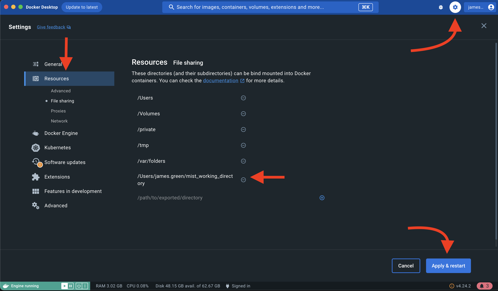

# Juniper mist integration script

This repo has been developed by the DevOps Lan&Wi-Fi to automate site creation on juniper mist.

## Run script as end user (Assuming you don't have the repo cloned)

### Required package prerequisites

#### Docker

[Docker docs mac install](https://docs.docker.com/desktop/install/mac-install/)

### Run script:

1. Copy this in your terminal and paste to create the working directory.

```
mkdir -p ~/mist_working_directory/data_src && cd ~/mist_working_directory
```

2. Copy this in your terminal and paste

```
curl -o .env https://raw.githubusercontent.com/ministryofjustice/juniper-mist-integration/main/example.env
```

3. Configure .env file:
   Review the .env file by running:

```
nano ~/example.env
```

To fully take advantage of the .env files, you can duplicate them and have different .envs per environment.
If you choose to do this make sure you edit the docker run command in step 6 to pass in the correctly named file.

```
.env-dev
.env-prod
```

4. Create a csv file named: `sites_with_clients.csv` within '~/mist_working_directory/data_src'
   or copy the [example CSV](./example.sites_with_clients.csv) (which is formatted correctly) with the following command to the data directory:

```
curl -o data_src/sites_with_clients.csv https://raw.githubusercontent.com/ministryofjustice/juniper-mist-integration/main/example.sites_with_clients.csv
```

5. Make sure docker can mount the `~/mist_working_directory`

Within Docker Desktop Cog --> Resources --> File Sharing --> add `/Users/$YOURUSERNAME/mist_working_directory`



6. Copy this in your terminal and paste to download and run the Dockerized tooling:

Linux users:
```
docker pull ghcr.io/ministryofjustice/nvvs/juniper-mist-integration/app:latest; docker run -it -v ./data_src:/data_src --env-file .env ghcr.io/ministryofjustice/nvvs/juniper-mist-integration/app:latest
```

Windows Users:
```
docker pull ghcr.io/ministryofjustice/nvvs/juniper-mist-integration/app:latest; docker run -it -v .\data_src:/data_src --env-file .env ghcr.io/	ministryofjustice/nvvs/juniper-mist-integration/app:latest
```

## Development setup

### Prerequisites

- Docker
- IDE that integrates with docker (We use IntelliJ in this example)

### Setup

- Run `make build`
- Integrate built docker container with IDE. [here](https://www.jetbrains.com/help/idea/configuring-remote-python-sdks.html#2546d02c) is the example for intelliJ
- mark src directory & test directory within the IDE. [here](https://www.jetbrains.com/help/idea/content-roots.html)
- Setup environment vars within the IDE. [IntelliJ_docs](https://www.jetbrains.com/help/objc/add-environment-variables-and-program-arguments.html) & [env_file](example.env)

# Notes

- To see options run `make help`
- If you update [requirements.txt](src/requirements.txt), you will need to rebuild the docker container.
